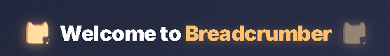
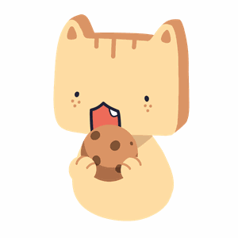
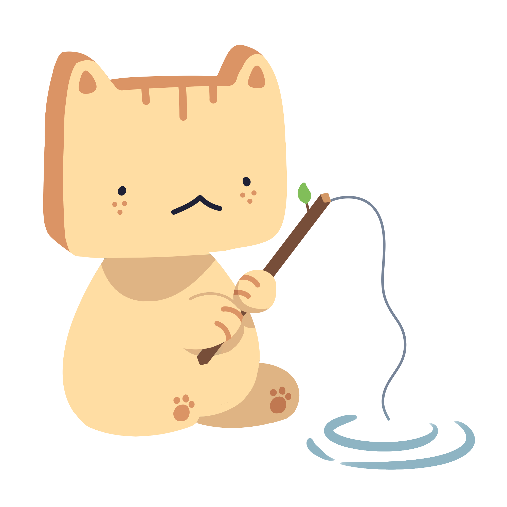

**breadcrumbing** _<sup>verb.</sup>_\
_splitting work into smaller parts to motivate people to see their progress on their work._

# about
Breadcrumber is an app that helps creatives stay motivated by turning overwhelming passion projects into manageable steps through "breadcrumbing". Designed for artists, developers, students, and people who struggle with burnout, focus, or ADHD, the app combines productivity with encouragement through streaks, visual roadmaps, timers, and AI-generated workflows tailored to each project.

# features
- 🍞 tab-based project manager
- 🥐 AI-based task atomizer with file uploading prompt system
- 🥖 daily streak and notification system
- 🫓 focus & break timer (pomodoro)
- 🥯 proof-based to-do list by file upload system

# running the app

### first time setup

**terminal 1 — backend**
```
cd backend
python -m venv venv
venv\Scripts\activate
pip install -r requirements.txt
uvicorn main:app --reload
```

**terminal 2 — frontend**
```
cd frontend
npm install
npm run dev
```

### after the first time

**terminal 1 — backend**
```
cd backend
venv\Scripts\activate
uvicorn main:app --reload
```

**terminal 2 — frontend**
```
cd frontend
npm run dev
```

you'll also need a `.env` file inside the `backend/` folder:
```
GROQ_API_KEY=your_groq_api_key_here
```

# about the team
This is our first time developing something together as a team. We worked on this for 5 days.<br>
Updates will be continuously be released and bugs will be fixed, even after the event.<br>
We look forward to working on more projects.<br>
~ Team F.I.S.H 🐟

<table>
  <tr>
    <td align="center">
      <a href="https://github.com/rhonacailao">
        <br/>
        <sub><b>rhonacailao</b></sub>
      </a>
    </td>
    <td align="center">
      <a href="https://github.com/John-Patrick-Narvasa">
        <br/>
        <sub><b>John-Patrick-Narvasa</b></sub>
      </a>
    </td>
    <td align="center">
      <a href="https://github.com/bearbau">
        <br/>
        <sub><b>bearbau</b></sub>
      </a>
    </td>
  </tr>
</table>

